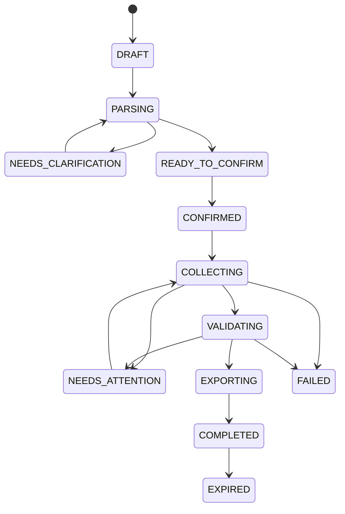
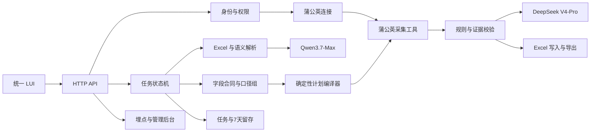

# 寻达 Agent LUI 达人工作台：产品与技术方案

> 状态：第一版已实现，待带有效蒲公英登录态完成生产数据验收
> 版本：1.1
> 日期：2026-07-30
> 当前结果：字段合同、状态机、动态采集计划、统一 LUI、账户权限、7 天留存、个人中心和管理后台已接通；旧寻找达人能力作为 LUI 工具保留

## 1. 执行摘要

寻达将从“按品牌 Excel 模板定制采集”的工具，升级为一个由确定性任务状态机管理的 Agent 工作台。

产品采用统一的语言用户界面（LUI）作为入口。用户可以上传 Excel、粘贴蒲公英链接或使用自然语言描述任务；AI 负责理解需求、识别歧义、提出最小追问、解释异常和生成有证据的数据概述；程序负责字段合同、采集计划、蒲公英取数、公式计算、结果校验、Excel 写入、权限和留存。

最终技术原则为：

> 一个统一的 LUI 入口；AI 主动理解并通过最小追问完成确认；结构化任务合同在后台持续维护；确定性状态机控制全过程；模型负责理解、规划、解释和异常处理，程序负责字段合同、取数、计算、校验和写入。

## 2. 背景与核心问题

品牌对达人表现数据的要求具有高度不确定性：

- 不同品牌对达人评价标准不同。
- 同一品牌在不同营销阶段需要不同字段。
- 同一批达人可能临时增加或删除少数字段。
- Excel 表头经常只写“曝光中位数”“阅读中位数”，但没有明确合作/日常、图文/视频、周期、全流量/自然流等完整口径。
- Excel 中还混有推荐理由、账号数据表现、合作方式、授权情况等非蒲公英字段。

蒲公英中的一个数据值不是由“字段名称”单独决定，而是由完整维度共同决定：

```text
指标 × 统计方式 × 笔记属性 × 内容类型 × 时间周期 × 流量范围 × 数据视图
```

例如“曝光中位数（90天）”仍不足以唯一确定目标数据。它至少还需要明确：

- 合作笔记或日常笔记。
- 图文、视频或图文+视频。
- 全流量或仅自然流量。
- 按规模或其他数据视图。

当前模板化模式把这些维度固化在品牌代码中，导致：

- 表格可以正常导出，但口径可能错误。
- 新品牌、新阶段和增量字段需要重新开发。
- 空白值无法区分无样本、不支持、描述不明确或采集失败。
- 模型可能被错误地用于填充无法证明的业务事实。

根本问题不是采集脚本不够多，而是系统缺少从人类表述到唯一蒲公英口径的语义合同。

## 3. 产品目标

### 3.1 核心目标

1. 只要蒲公英字段已进入字段库，新增品牌或调整字段不再需要开发采集模板。
2. 所有进入采集阶段的字段都必须具有完整、无歧义的数据口径。
3. 用户不需要逐项检查几十个字段；AI 完成大部分理解，只把真正影响结果的歧义交给用户判断。
4. 蒲公英原始字段、确定性公式、模型证据字段和人工业务字段使用不同处理路径。
5. 采集任务可以中断续跑、追溯来源、解释空白并在 7 天内重新下载。
6. 普通用户只需登录寻达；首次连接蒲公英后长期复用登录态，失效时重新连接。
7. 管理员可以查看产品使用、模型表现和采集稳定性，但不能查看密码、Cookie、API Key 或完整登录态。

### 3.2 成功指标

- 已注册字段的品牌新增开发次数：0。
- 存在未解决关键维度但仍进入采集的任务数：0。
- 公式错误、错列写入和不同口径混写：0。
- 业务事实字段被模型推断填写：0。
- 任务完成后可在 7 天内下载的比例：100%。
- 采集中断后可从达人或口径组检查点恢复的比例：100%。
- 管理员可追踪的任务成功率、模型失败率和登录态失效率覆盖率：100%。

## 4. 产品范围

### 4.1 第一阶段：采集数据基础设施

- 蒲公英字段合同与能力矩阵。
- Excel 表头解析与字段映射。
- 歧义识别和自然语言确认。
- 动态口径组。
- 确定性任务状态机。
- 通用采集计划编译器。
- 蒲公英采集、检查点和异常恢复。
- 公式、模型字段和 Excel 写入。
- 任务数据 7 天留存。

### 4.2 第二阶段：账户、LUI 与管理能力

- 寻达自有账号登录。
- 管理员与媒介用户角色。
- 每个用户独立的蒲公英连接。
- 统一 LUI 输入框。
- 最近 7 天任务。
- 个人中心。
- 管理后台和数据埋点。

### 4.3 第三阶段：寻找达人统一入口

- 在统一输入框中增加“采集数据”“寻找达人”两个轻量模式控件。
- 自动识别寻找和采集意图。
- 复用现有寻找达人后端。
- 支持“先寻找，再采集”的连续任务。

### 4.4 暂不进入第一版

- 将蒲公英账号直接作为寻达唯一登录身份。
- 未经验证的蒲公英 OAuth/SSO。
- 自动在蒲公英下单、充值或修改品牌授权。
- 永久保存达人表现数据。
- 自动同步企业微信或腾讯文档。
- 允许模型直接控制任意浏览器操作、任意 SQL 或任意文件写入。

## 5. 用户与权限

### 5.1 媒介用户

- 创建、确认、执行和下载自己的任务。
- 查看自己最近 7 天的任务。
- 连接、重新连接或解除自己的蒲公英账号。
- 查看自己的任务表现和失败原因。
- 不得查看其他用户的任务、登录态或管理员埋点。

### 5.2 管理员

- 创建、停用和管理寻达用户。
- 配置用户角色。
- 查看系统级聚合埋点、任务稳定性和模型表现。
- 查看蒲公英连接是否健康，但不能查看 Cookie、密码或完整浏览器状态。
- 管理 7 天留存策略和系统配置。

### 5.3 系统 Agent

- 只能调用白名单工具。
- 只能通过状态机修改任务。
- 不能自行确认关键歧义。
- 不能编造蒲公英数据、业务事实或计算结果。

## 6. 信息架构

```text
寻达
├── 统一 LUI 工作台
│   ├── 采集数据
│   ├── 寻找达人
│   ├── 上传 Excel / 粘贴链接
│   ├── 自然语言澄清
│   ├── 任务进度与异常处理
│   └── 最近 7 天任务
├── 个人中心
│   ├── 我的账号
│   ├── 蒲公英连接
│   ├── 我的数据表现
│   └── 数据与隐私
└── 管理后台
    ├── 用户与角色
    ├── 产品使用埋点
    ├── 采集稳定性
    ├── 模型调用表现
    └── 系统配置
```

## 7. LUI 交互原则

### 7.1 统一入口

输入框上方只保留两个轻量控件：

```text
[采集数据]  [寻找达人]

上传 Excel、粘贴蒲公英链接，或描述你需要的达人……
```

控件帮助 AI 判断意图，但不形成两个割裂页面。系统也应自动判断：

- 上传 Excel 或粘贴蒲公英链接：优先识别为采集数据。
- 输入“寻找 50 位母婴达人”：识别为寻找达人。
- 输入“先找 20 位母婴达人，再采集 90 天合作笔记”：生成两阶段任务。

第一版默认激活“采集数据”；“寻找达人”只完成 UI 合并和现有能力接入。

### 7.2 确认方式

AI 不要求用户浏览结构化字段卡片，而是先完成理解，再使用“理解复述＋最小追问”：

> 我理解这份表需要：90 天合作笔记的图文+视频全流量数据；其中自然流曝光和阅读使用同一口径的仅自然流量；30 天日常笔记使用图文+视频全流量。唯一不明确的是“近16篇”是否区分合作或日常；如果没有特殊要求，我将按全部笔记处理，请确认。

用户只需回答：

> 对，按全部笔记。

系统反馈：

> 已确认 4 个取数口径组、30 个蒲公英字段、3 个公式字段、4 个模型字段和 3 个人工字段。是否开始采集？

详细任务合同默认折叠在“查看取数详情”中，只用于追溯和高级修改。

### 7.3 追问规则

- 同类歧义合并提问。
- 每轮最多提出 3 个真正影响结果的问题。
- 优先给出 AI 的推荐理解、理由和影响范围。
- 优先使用“是否正确”或 2—3 个选项。
- 已能从父级表头、模板、当前对话或字段合同确定的内容不重复提问。
- 用户说“对”“按你理解的来”“第二种”即可形成正式决策事件。
- 关键口径修改后必须重新确认。

### 7.4 状态反馈

采集过程中不持续打扰用户，只反馈阶段进度：

```text
已完成需求解析
已完成 3/10 位达人
正在校验公式和字段来源
已生成 Excel，可在 7 天内下载
```

只有以下情况暂停：

- 蒲公英登录态失效。
- 关键字段无法唯一映射。
- 蒲公英页面或接口能力发生变化。
- Excel 结构无法安全写入。
- 需要用户选择重试、跳过或人工处理。

## 8. 字段合同与动态口径组

### 8.1 字段合同

每个蒲公英值都由完整合同定义：

```json
{
  "fieldId": "pgy.note.exposure.median",
  "metric": "exposure",
  "statistic": "median",
  "noteScene": "cooperation",
  "contentType": "all",
  "window": "90d",
  "traffic": "all",
  "view": "scale",
  "unit": "count",
  "source": "pgy",
  "uiPath": ["笔记数据", "合作笔记", "图文+视频", "近90日", "全流量", "按规模"]
}
```

字段库还要记录：

- 显示名称和别名。
- 可选维度和禁用组合。
- 请求方式、路径和参数。
- 响应数据路径。
- 单位和格式。
- 0、无样本、未支持和失败的语义。
- 验证状态和适用版本。
- 所需蒲公英权限。

### 8.2 动态口径组

系统按完整维度聚类字段。同一任务可以同时存在：

| 组 | 笔记属性 | 内容类型 | 周期 | 流量 | 代表字段 |
|---|---|---|---|---|---|
| A | 合作 | 图文+视频 | 90天 | 全流量 | 曝光、阅读、点赞、收藏、流量来源 |
| B | 合作 | 图文+视频 | 90天 | 仅自然流量 | 曝光、阅读 |
| C | 日常 | 图文+视频 | 30天 | 全流量 | 曝光、阅读、点赞、收藏 |
| D | 全部笔记 | 图文+视频 | 近16篇 | 原始笔记 | 最高阅读、点赞、收藏 |

确认门固定的是“每个字段必须完整解析”的规则，不固定任务只能有一种口径。

### 8.3 歧义解决顺序

1. Excel 父级表头和合并单元格。
2. Excel 子级表头。
3. 用户本轮自然语言描述。
4. 已确认模板和历史字段映射。
5. 字段别名与确定性规则。
6. Qwen 字段语义候选。
7. 用户最小追问。

仍缺少必要维度时，任务不得进入确认状态。

## 9. 字段填写策略

| 类型 | 示例 | 处理方式 |
|---|---|---|
| 蒲公英原始字段 | 粉丝数、曝光中位数 | 按完整字段合同采集 |
| 确定性公式 | 下单价、实际花费、CPC | 程序生成 Excel 公式 |
| 模型证据字段 | 账号数据表现、推荐理由 | 只基于允许的证据字段生成 |
| 受限推断字段 | 达人类型、内容方向 | 有标签或明确证据时才能填 |
| 业务事实字段 | 是否合作、合作方式、授权情况 | 人工填写，模型不得推断 |
| 不支持字段 | 蒲公英不存在且无证据 | 留空并记录原因 |

每个输出值都要保存：

- 来源类型。
- 字段合同 ID。
- 证据字段或公式依赖。
- 采集时间。
- 模型和规则版本。
- 空白原因。

## 10. 确定性状态机



合法状态为：

```text
DRAFT
PARSING
NEEDS_CLARIFICATION
READY_TO_CONFIRM
CONFIRMED
COLLECTING
NEEDS_ATTENTION
VALIDATING
EXPORTING
COMPLETED
FAILED
EXPIRED
DELETED
```

状态变化必须由程序验证：

- 关键维度未解决不能进入 `READY_TO_CONFIRM`。
- 未记录用户确认事件不能进入 `CONFIRMED`。
- 未确认不能执行采集。
- 校验失败不能生成最终下载文件。
- 超过 7 天自动进入 `EXPIRED` 并删除任务文件。

## 11. Agent 工作流

### 11.1 模型分工

#### Qwen3.7-Max

- 用户意图理解。
- Excel 表头和业务描述解析。
- 字段映射候选。
- 澄清问题生成。
- LUI 回复和工具选择。

#### DeepSeek V4-Pro

- 字段合同复核。
- 低置信度和冲突检查。
- 异常原因解释。
- 账号数据表现和推荐理由。
- Qwen 失败时的受控备用解析。

#### 确定性程序

- 字段合同校验。
- 口径组生成。
- 请求参数和页面路径。
- 蒲公英采集。
- 公式计算。
- 数据类型和空值状态。
- Excel 写入和导出。
- 权限、留存和审计。

### 11.2 Agent 工具白名单

```text
parse_excel
resolve_field_candidates
list_field_variants
apply_scope_decision
request_clarification
confirm_task_contract
compile_collection_plan
check_pgy_connection
collect_scope_group
validate_collection
generate_evidence_text
export_excel
retry_failed_scope
skip_failed_creator
```

模型不能直接获得 Cookie、数据库连接、任意文件系统或任意浏览器控制能力。

### 11.3 模型调用策略

- 已知字段使用规则，不调用模型。
- 一份模板只解析一次，不按达人重复解析。
- Qwen 只处理无法由规则解决的语义。
- DeepSeek 只复核低置信度、高风险或需要生成说明的内容。
- 两个模型不对所有字段重复调用。
- 模型输出必须通过本地 Schema 和业务规则校验。
- 模型超时、空响应或格式错误时执行有限重试，再切换备用模型。
- 模型失败不能改变蒲公英原始值或公式结果。

模型密钥只通过环境变量或仓库外的密钥文件运行时加载，不写入代码、数据库、日志或 Excel。

## 12. 蒲公英采集执行

### 12.1 执行流程

1. 将已确认任务合同编译成去重后的口径组和请求计划。
2. 检查用户蒲公英连接。
3. 按达人和口径组执行采集。
4. 每完成一位达人或一个口径组保存检查点。
5. 保存参数签名、响应状态和目标字段证据。
6. 运行字段完整性、单位、范围和公式依赖校验。
7. 模型只处理允许的证据字段。
8. 按原表格式写入 Excel。
9. 扫描公式错误和错列。
10. 生成下载文件和质量摘要。

### 12.2 空值状态

字段不得只保存空字符串。内部至少区分：

```text
VALUE
ZERO
NO_SAMPLE
UNSUPPORTED
UNRESOLVED
COLLECTION_FAILED
PERMISSION_DENIED
MODEL_UNSUPPORTED
MANUAL_REQUIRED
```

### 12.3 恢复策略

- 达人级检查点。
- 口径组级检查点。
- 幂等导出。
- 服务重启后运行中任务进入 `NEEDS_ATTENTION`，允许继续而不是简单失败。
- 登录态失效只暂停受影响任务。
- 页面结构变化触发能力验证，不自动回退到其他口径。

## 13. 寻达账号与蒲公英连接

### 13.1 寻达账号

第一版采用管理员邀请制：

- 管理员创建账号。
- 用户首次登录修改初始密码。
- 密码使用安全哈希，不保存明文。
- 使用安全会话 Cookie。
- 角色至少包括 `admin` 和 `media`。

### 13.2 蒲公英连接

- 用户首次采集时点击或通过 LUI 执行“连接蒲公英”。
- 系统打开受控登录窗口。
- 用户完成扫码或验证。
- 寻达加密保存该用户独立的浏览器登录态。
- 后续登录寻达后自动检查并复用。
- 失效时提示重新连接。
- 用户可以解除连接。
- 管理员只能查看连接健康状态。

不保存蒲公英密码，不承诺永久登录。产品承诺为：

> 登录态长期保存并自动复用；失效前无需重复登录，失效后只需重新连接一次。

### 13.3 工作区共享连接

如果团队共用蒲公英主账号，管理员可以显式创建“工作区共享连接”，并授权指定角色使用。个人连接不得默认共享。

## 14. 7 天任务留存

### 14.1 保存内容

- 输入 Excel。
- 任务合同和版本。
- 达人链接。
- 采集结果。
- 允许保存的证据。
- 输出 Excel。
- 任务日志和失败原因。

### 14.2 到期规则

- 创建时写入 `expires_at = created_at + 7 days`。
- 用户可以提前删除。
- 到期后删除输入、原始采集、输出和模型内容。
- 数据库任务状态改为 `EXPIRED`。
- 只保留不含达人明细的聚合埋点和删除审计事件。

### 14.3 最近任务

LUI 主界面展示最近 7 天任务：

- 名称、创建人、状态、达人数量和口径摘要。
- 创建时间、完成时间和到期时间。
- 继续、重试、复制任务和下载。
- 用户可用自然语言打开任务，例如“打开我昨天的美德乐任务”。

## 15. 个人中心

### 15.1 我的账号

- 姓名、账号和角色。
- 修改密码。
- 当前登录设备和退出。

### 15.2 蒲公英连接

- 已连接账号的脱敏名称。
- 连接状态。
- 最后验证时间。
- 重新连接和解除连接。
- 个人连接或工作区共享连接标识。

### 15.3 我的数据表现

- 近 7 天任务数。
- 采集达人数量。
- 成功率和平均耗时。
- 常见失败原因。
- 导出次数。

### 15.4 数据与隐私

- 7 天保存说明。
- 提前删除任务。
- 蒲公英登录态使用说明。

## 16. 管理后台

### 16.1 用户与角色

- 创建、启用和停用用户。
- 分配 `admin` 或 `media`。
- 查看用户最后登录和连接健康状态。

### 16.2 产品埋点

至少记录：

```text
user_login_success
user_login_failed
pgy_connect_started
pgy_connect_success
pgy_connection_expired
task_created
task_parse_completed
clarification_requested
clarification_resolved
task_confirmed
collection_started
scope_group_completed
collection_completed
collection_failed
validation_failed
export_generated
export_downloaded
task_expired
task_deleted
model_call_completed
model_call_failed
```

### 16.3 管理指标

- 日活用户。
- 创建、完成、失败和导出任务数。
- 采集成功率和平均耗时。
- 每位达人平均耗时。
- 登录态失效、接口超时、字段缺失和页面变化。
- AI 追问次数、一次确认率和人工修正率。
- Qwen/DeepSeek 调用量、延迟、失败率、重试率和成本。

管理员默认只看聚合表现，不展示 Excel 内容、达人表现明细、Cookie、密码、请求头或 API Key。

## 17. 逻辑架构



## 18. 核心数据模型

### users

```text
id
email
display_name
password_hash
role
status
created_at
updated_at
last_login_at
```

### user_sessions

```text
id
user_id
token_hash
expires_at
created_at
last_seen_at
revoked_at
```

### pgy_connections

```text
id
owner_type
owner_id
encrypted_storage_state_path
masked_account_name
status
last_verified_at
expires_hint_at
created_at
updated_at
```

### jobs

在现有任务表上增加：

```text
owner_user_id
workspace_id
state
task_contract_json
task_contract_version
confirmation_json
expires_at
deleted_at
resumable
```

### job_scope_groups

```text
id
job_id
scope_json
field_ids_json
status
progress_json
checkpoint_json
error_code
created_at
updated_at
```

### job_artifacts

```text
id
job_id
artifact_type
path
expires_at
created_at
deleted_at
```

### analytics_events

继续使用现有事件表，但由服务端会话写入真实 `user_id`，并执行敏感字段清洗。

## 19. 功能需求

### 任务与字段

- FR-001：支持 Excel、链接和自然语言三种采集输入。
- FR-002：支持单任务多个口径组。
- FR-003：每个蒲公英字段必须绑定完整字段合同。
- FR-004： unresolved 字段必须触发澄清，不能采集。
- FR-005：用户确认后保存任务合同版本和确认事件。
- FR-006：已注册字段可以跨品牌直接使用。
- FR-007：固化模板保存字段合同组合，不保存品牌专用采集代码。
- FR-008：支持在固化模板上增删少量字段。

### Agent 与 LUI

- FR-009：AI 使用理解复述和最小追问。
- FR-010：同类歧义合并提问。
- FR-011：用户自然语言回答可以更新任务合同。
- FR-012：关键口径修改必须重新确认。
- FR-013：AI 工具调用必须经过 Schema 和权限校验。
- FR-014：模型失败不影响原始蒲公英字段和公式。

### 采集与导出

- FR-015：按达人和口径组保存检查点。
- FR-016：登录态失效时暂停并允许重新连接后继续。
- FR-017：页面无法切换时不得回退到其他口径。
- FR-018：每个空白值记录状态和原因。
- FR-019：确定性字段使用 Excel 公式。
- FR-020：模型字段保存证据键和验证结果。
- FR-021：保留原 Excel 样式、合并单元格和已有内容。
- FR-022：导出前扫描公式错误和错列。

### 账户与留存

- FR-023：支持管理员邀请制寻达账号。
- FR-024：支持管理员和媒介角色。
- FR-025：每个用户可以独立连接蒲公英。
- FR-026：支持显式工作区共享连接。
- FR-027：普通访问自动复用有效蒲公英登录态。
- FR-028：任务及文件保存 7 天。
- FR-029：支持用户提前删除。
- FR-030：到期后自动删除任务内容。

### 管理后台

- FR-031：管理员查看用户和角色。
- FR-032：管理员查看采集、模型和登录态聚合指标。
- FR-033：管理员不能查看敏感登录态内容。
- FR-034：用户只能查看自己的任务和个人数据表现。

## 20. 非功能要求

### 安全

- 密码不得明文存储。
- 会话 Cookie 使用 HttpOnly、SameSite 和生产环境 Secure。
- 蒲公英登录态按用户隔离并加密保存。
- API Key 仅运行时读取。
- 埋点清洗密码、Cookie、Token、请求头和原始授权数据。

### 稳定性

- 状态转换幂等。
- 任务支持中断续跑。
- 模型调用设置超时、重试和备用模型。
- 蒲公英页面变化触发能力错误，不静默降级。
- SQLite 和 PostgreSQL 使用同一逻辑 Schema。

### 可观测性

- 每次状态转换都有事件。
- 每个失败都有稳定错误码。
- 每个模型调用记录模型、延迟、Token、重试和结果状态。
- 每个采集值可以追溯到字段合同和请求参数签名。

### 可用性

- 普通用户无需阅读完整字段库即可完成任务。
- 每轮最多 3 个澄清问题。
- 已确认模板只提示变化部分。
- 最近任务可通过自然语言查找。

## 21. 发布阶段与门槛

### Release 0：字段合同和状态机

必须通过：

- 当前美德乐测试表正确拆成多个口径组。
- 模糊字段无法绕过澄清门。
- 视频与图文+视频不会被静默混用。
- CPC 固定引用自然流阅读。

### Release 1：通用采集闭环

必须通过：

- 当前美德乐表、富士表和一份无模板表端到端完成。
- 服务重启后任务可继续。
- 所有空白都有原因。
- Excel 公式错误为 0。

### Release 2：账户、连接和 7 天留存

必须通过：

- 用户只能查看自己的任务。
- 管理员权限正确。
- 蒲公英连接按用户隔离。
- 过期文件和记录自动清理。
- 敏感信息不进入埋点。

### Release 3：LUI

必须通过：

- 用户可以只通过自然语言完成测试表确认。
- AI 追问不要求逐项浏览全部字段。
- 所有对话修改都能还原为任务合同事件。
- 未确认任务无法采集。

### Release 4：寻找达人统一入口

必须通过：

- 一个输入框可以切换或自动识别寻找/采集。
- 现有寻找达人结果不回归。
- “寻找后采集”形成两个有依赖关系的阶段。

## 22. 风险与控制

| 风险 | 控制 |
|---|---|
| 模型误解表头 | 字段候选、置信度、最小追问、用户确认 |
| 模型工具参数错误 | 白名单工具、Schema、本地校验 |
| 蒲公英页面变化 | 能力矩阵版本、明确失败、不静默回退 |
| 登录态失效 | 连接健康检查、暂停和重新连接 |
| 多用户登录态串用 | 每用户隔离、工作区共享需显式授权 |
| 任务数据泄露 | 7 天 TTL、提前删除、权限隔离 |
| 管理埋点泄露敏感值 | 服务端清洗、聚合展示 |
| 双模型成本和延迟 | 规则优先、只处理歧义和高风险字段 |
| LUI 成为演示玩具 | 状态机、字段合同和采集闭环先于界面 |

## 23. 最终验收定义

产品可交付给团队使用，必须同时满足：

1. 新品牌使用字段库现有字段时不需要开发。
2. 一项任务可以并存多个时间、笔记属性和流量口径。
3. AI 只追问真正无法确定的业务问题。
4. 用户不查看详细字段合同也能完成正确确认。
5. 所有采集、公式、模型和人工字段边界明确。
6. 任务可恢复、可追溯、可解释并在 7 天内下载。
7. 普通用户登录寻达后自动复用有效蒲公英连接。
8. 管理员可以观测系统表现但接触不到敏感凭据。
9. 统一 LUI 可以承载采集数据，并在后续无缝接入寻找达人。
